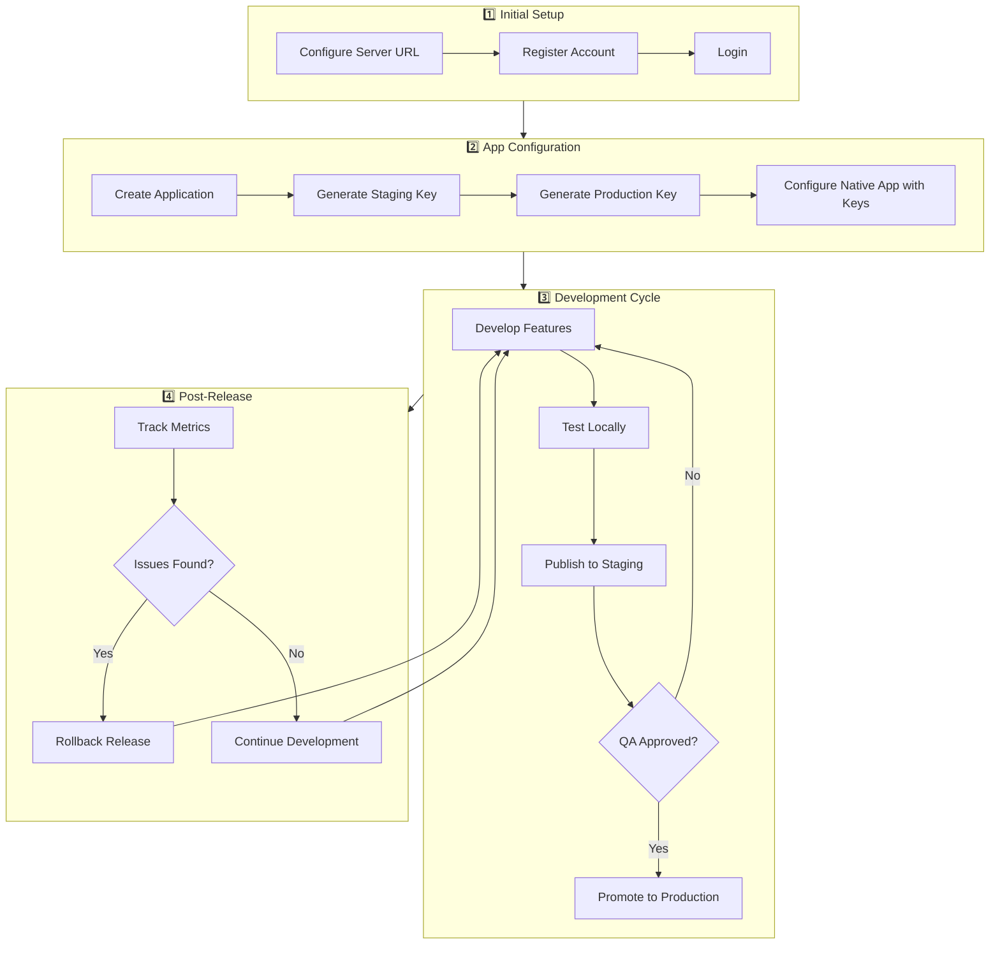
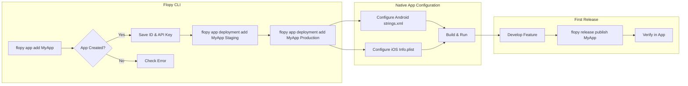
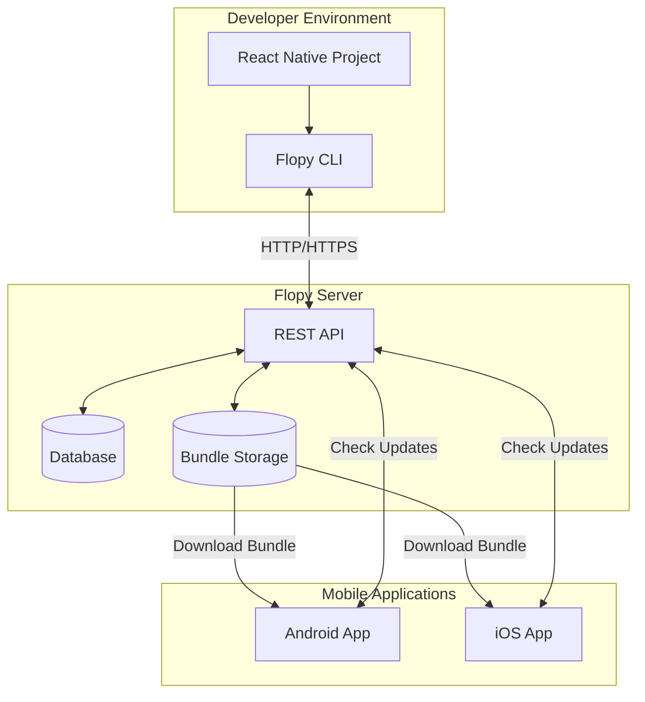
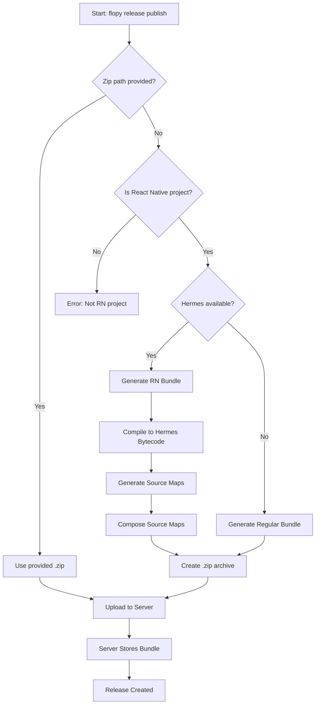
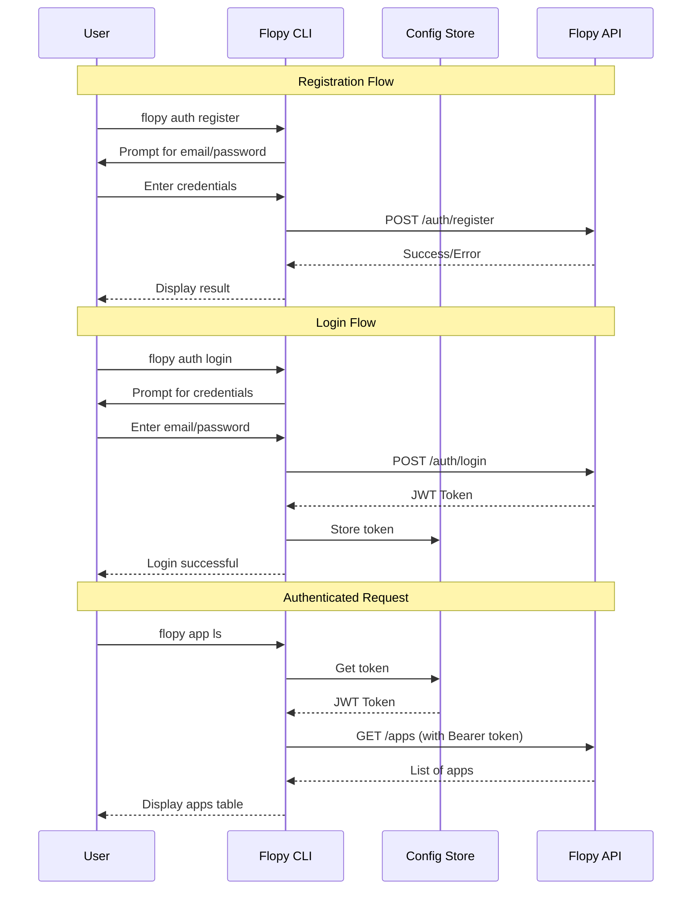
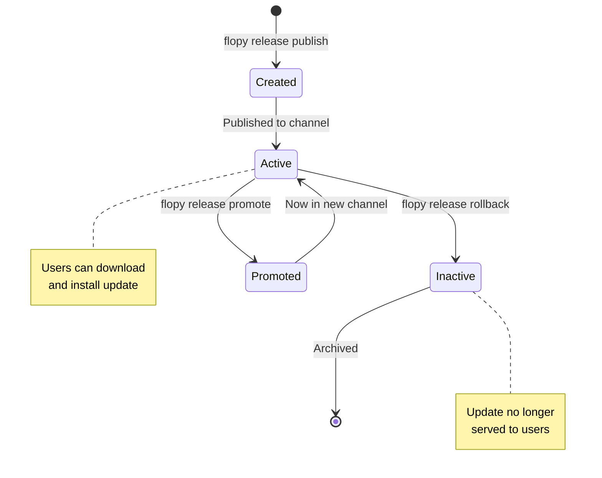

# 🚀 Flopy CLI

> A professional command-line interface for managing OTA (Over-The-Air) updates with the Flopy service for React Native applications.


---

## 📑 Table of Contents

- [Overview](#-overview)
- [Installation](#-installation)
- [Quick Start](#-quick-start)
- [Complete Workflow](#-complete-workflow)
- [Commands Reference](#-commands-reference)
  - [Configuration Commands](#configuration-commands)
  - [Authentication Commands](#authentication-commands)
  - [Application Commands](#application-commands)
  - [Deployment Keys Commands](#deployment-keys-commands)
  - [Release Commands](#release-commands)
- [Adding an Application Step by Step](#-adding-an-application-step-by-step)
- [Architecture & Flow Diagrams](#-architecture--flow-diagrams)
- [Error Handling](#-error-handling)
- [Project Structure](#-project-structure)

---

## 🔍 Overview

Flopy CLI enables you to:

- ✅ **Register and authenticate** users with the Flopy OTA server
- ✅ **Create and manage** multiple applications
- ✅ **Generate deployment keys** for different channels (Staging, Production)
- ✅ **Publish OTA updates** with automatic React Native bundling and Hermes bytecode compilation
- ✅ **Rollback, promote, and track** release metrics

---

## 📦 Installation

### Prerequisites

| Requirement | Minimum Version |
|-------------|-----------------|
| Node.js     | 16.x or higher  |
| npm / bun   | Latest stable   |
| zip         | System utility  |

### Install from source

```bash
# Clone the repository
git clone https://github.com/your-org/flopy-cli.git
cd flopy-cli

# Install dependencies
npm install
# or
bun install

# Build the project
npm run build

# Link globally (optional)
npm link
```

### Verify installation

```bash
flopy --version
# Output: 0.1.0
```

---

## ⚡ Quick Start

```bash
# 1. Configure the server URL
flopy config set-url https://your-flopy-server.com

# 2. Register a new account (first time only)
flopy auth register

# 3. Login to your account
flopy auth login

# 4. Create your first application
flopy app add "MyAwesomeApp"

# 5. Create deployment keys for channels
flopy app deployment add MyAwesomeApp Staging
flopy app deployment add MyAwesomeApp Production

# 6. Publish your first update (from your React Native project)
flopy release publish MyAwesomeApp --channel Staging
```

---

## 🔄 Complete Workflow



---

## 📖 Commands Reference

### Configuration Commands

Manage the CLI configuration settings.

| Command | Description | Example |
|---------|-------------|---------|
| `config set-url <url>` | Set the Flopy server URL | `flopy config set-url https://api.flopy.io` |
| `config get-url` | Display the current server URL | `flopy config get-url` |

#### Example: Setting up the server URL

```bash
$ flopy config set-url https://api.flopy.io
✅ URL del servidor establecida a: https://api.flopy.io

$ flopy config get-url
La URL del servidor actual es: https://api.flopy.io
```

---

### Authentication Commands

Manage user registration and authentication.

| Command | Alias | Description |
|---------|-------|-------------|
| `auth register` | - | Create a new user account |
| `auth login` | - | Login with email and password |
| `auth logout` | - | Clear the current session |
| `auth whoami` | - | Verify if the current session is valid |

#### Example: Complete authentication flow

```bash
# Step 1: Register a new account
$ flopy auth register
Vamos a crear tu nueva cuenta de Flopy.
? Introduce tu email: developer@company.com
? Crea una contraseña: ********
? Confirma tu contraseña: ********
✔ ¡Cuenta creada con éxito!
Ahora puedes iniciar sesión con el comando: flopy auth login

# Step 2: Login
$ flopy auth login
? Introduce tu email: developer@company.com
? Introduce tu contraseña: ********
✔ ¡Login exitoso! Bienvenido.

# Step 3: Verify session
$ flopy auth whoami
✔ Tu sesión actual es válida.

# Step 4: Logout (when needed)
$ flopy auth logout
Has cerrado sesión.
```

---

### Application Commands

Create and manage your applications.

| Command | Alias | Description |
|---------|-------|-------------|
| `app list` | `app ls` | List all your applications |
| `app add <name>` | - | Create a new application |
| `app remove <appId>` | `app rm` | Permanently delete an application |

#### Example: Creating and managing applications

```bash
# Create a new application
$ flopy app add "MyMobileApp"
✔ ¡Aplicación 'MyMobileApp' creada con éxito!
  ID: app_a1b2c3d4e5f6
  API Key: key_xyz789abc123

# List all applications
$ flopy app ls
┌──────────────────┬──────────────────────────────┬──────────────────────────────┐
│ Nombre           │ ID de App                    │ API Key                      │
├──────────────────┼──────────────────────────────┼──────────────────────────────┤
│ MyMobileApp      │ app_a1b2c3d4e5f6             │ key_xyz789abc123             │
│ AnotherApp       │ app_g7h8i9j0k1l2             │ key_def456ghi789             │
└──────────────────┴──────────────────────────────┴──────────────────────────────┘

# Remove an application (with confirmation)
$ flopy app rm app_g7h8i9j0k1l2
? ¿Estás seguro de que quieres eliminar la aplicación con ID 'app_g7h8i9j0k1l2'? Esta acción es irreversible. (y/N)
```

---

### Deployment Keys Commands

Manage deployment keys for different release channels.

| Command | Alias | Description |
|---------|-------|-------------|
| `app deployment add <appName> <channel>` | - | Create a new deployment key |
| `app deployment list <appName>` | `deployment ls` | List all deployment keys for an app |

#### Recommended Channels

| Channel | Purpose | Usage |
|---------|---------|-------|
| `Staging` | Pre-production testing | Internal QA and beta testers |
| `Production` | Live users | Released to all users |
| `Canary` | Early testing (optional) | Small percentage of users |

#### Example: Setting up deployment keys

```bash
# Create Staging deployment key
$ flopy app deployment add MyMobileApp Staging
✔ ¡Clave de despliegue creada con éxito!
  Canal: Staging
  Clave: dep_staging_abc123xyz789

Copia esta clave y pégala en la configuración de CodePush de tu app nativa.

# Create Production deployment key
$ flopy app deployment add MyMobileApp Production
✔ ¡Clave de despliegue creada con éxito!
  Canal: Production
  Clave: dep_production_def456uvw012

# List all deployment keys
$ flopy app deployment ls MyMobileApp
┌──────────────────────┬──────────────────────────────────────┐
│ Canal                │ Clave de Despliegue                  │
├──────────────────────┼──────────────────────────────────────┤
│ Staging              │ dep_staging_abc123xyz789             │
│ Production           │ dep_production_def456uvw012          │
└──────────────────────┴──────────────────────────────────────┘
```

---

### Release Commands

Publish and manage OTA updates.

| Command | Alias | Description | Options |
|---------|-------|-------------|---------|
| `release publish <appName> [zipPath]` | - | Publish an update | `-c, --channel`, `-t, --target-version`, `-m, --mandatory`, `-r, --rollout` |
| `release list <appName>` | `release ls` | List release history | - |
| `release metrics <releaseId>` | - | Show installation metrics | - |
| `release rollback <appName>` | - | Disable the latest active release | `-c, --channel` |
| `release promote <appName>` | - | Promote a release between channels | `-f, --from`, `-t, --to` |
| `release change-state <releaseId>` | - | Change release state | `-s, --state` |

#### Release Options Reference

| Option | Default | Description |
|--------|---------|-------------|
| `-c, --channel <channel>` | `Staging` | Target deployment channel |
| `-t, --target-version <version>` | `1.0.0` | Binary version this update targets |
| `-m, --mandatory` | `false` | Force users to update immediately |
| `-r, --rollout <percentage>` | `100` | Percentage of users to receive update |

#### Example: Complete release workflow

```bash
# Navigate to your React Native project
$ cd ~/projects/MyMobileApp

# Publish to Staging (auto-generates bundle with Hermes)
$ flopy release publish MyMobileApp --channel Staging --target-version 1.2.0
✔ Aplicación 'MyMobileApp' encontrada (ID: app_a1b2c3d4e5f6).
⠋ Detectado proyecto React Native. Creando bundle optimizado...
⠋ Generando bundle de React Native...
⠋ Compilando a bytecode de Hermes...
✔ Bundle Hermes bytecode creado con éxito (2.45 MB)
✓ Bundle pre-compilado con Hermes - no requiere parsing en runtime
✔ ¡Actualización publicada con éxito!

# Check release history
$ flopy release ls MyMobileApp
┌────────────┬──────────────┬─────────────────┬─────────────┬────────┐
│ ID         │ Canal        │ Versión Target  │ Obligatoria │ Activa │
├────────────┼──────────────┼─────────────────┼─────────────┼────────┤
│ rel_001    │ Staging      │ 1.2.0           │ No          │ ✅     │
│ rel_000    │ Production   │ 1.1.0           │ No          │ ✅     │
└────────────┴──────────────┴─────────────────┴─────────────┴────────┘

# Check metrics for a specific release
$ flopy release metrics rel_001
✔ Métricas de Despliegue para la release rel_001:

  Instalaciones Exitosas:  ✅ 1542
  Instalaciones Fallidas:  ❌ 12
  -----------------------------------
  Total de Reportes:       1554
  Tasa de Éxito:           99.23%

# Promote from Staging to Production
$ flopy release promote MyMobileApp --from Staging --to Production
✔ ¡Release promovida con éxito de 'Staging' a 'Production'!

# Rollback if issues are found
$ flopy release rollback MyMobileApp --channel Production
✔ Rollback exitoso. La release ya no está activa.
```

---

## 📱 Adding an Application Step by Step

This section provides a detailed walkthrough for adding a new application to Flopy and integrating it with your React Native project.

### Step 1: Prerequisites Check

Before adding an application, ensure:

- [x] Flopy CLI is installed and configured
- [x] You have an authenticated session
- [x] Your React Native project is ready

```bash
# Verify CLI configuration
$ flopy config get-url
La URL del servidor actual es: https://api.flopy.io

# Verify authentication
$ flopy auth whoami
✔ Tu sesión actual es válida.
```

### Step 2: Create the Application

```bash
$ flopy app add "my-react-native-app"
```

**Expected Output:**
```
✔ ¡Aplicación 'my-react-native-app' creada con éxito!
  ID: app_abc123def456
  API Key: key_789xyz012abc
```

> [!IMPORTANT]
> Save the **ID** and **API Key** - you'll need them for configuring your native app.

### Step 3: Create Deployment Keys

```bash
# For pre-production testing
$ flopy app deployment add my-react-native-app Staging

# For production releases
$ flopy app deployment add my-react-native-app Production
```

### Step 4: Configure Your React Native App

Add the deployment keys to your native application:

**For Android** (`android/app/src/main/res/values/strings.xml`):

```xml
<resources>
    <string name="app_name">My App</string>
    <string name="FlopyDeploymentKey">dep_staging_abc123xyz789</string>
</resources>
```

**For iOS** (`ios/MyApp/Info.plist`):

```xml
<key>FlopyDeploymentKey</key>
<string>dep_staging_abc123xyz789</string>
```

### Step 5: Publish Your First Update

```bash
$ cd ~/your-react-native-project
$ flopy release publish my-react-native-app --channel Staging
```

### Application Setup Flowchart



---

## 🏗️ Architecture & Flow Diagrams

### System Architecture



### Bundle Creation Process



### Authentication Flow



### Release Lifecycle



---

## ⚠️ Error Handling

The CLI provides detailed error messages for common scenarios:

| Error Type | HTTP Code | Description | Solution |
|------------|-----------|-------------|----------|
| Network Error | - | Cannot connect to server | Check `flopy config get-url` and network |
| Unauthorized | 401 | Invalid or expired token | Run `flopy auth login` |
| Forbidden | 403 | No permission for action | Verify account permissions |
| Not Found | 404 | Resource doesn't exist | Check app name/ID spelling |
| Conflict | 409 | Resource already exists | Use different name or update existing |
| Server Error | 500 | Internal server error | Contact server administrator |

### Example Error Output

```bash
$ flopy app add "ExistingApp"
✖ No se pudo crear la aplicación.
Error del servidor (409):
  An application with this name already exists.
```

---

## 📁 Project Structure

```
flopy-cli/
├── src/
│   ├── index.ts              # Entry point - CLI initialization
│   ├── commands/
│   │   ├── app.ts            # Application management commands
│   │   ├── auth.ts           # Authentication commands
│   │   ├── config.ts         # Configuration commands
│   │   └── release.ts        # Release/deployment commands
│   └── lib/
│       ├── api-client.ts     # Axios HTTP client with interceptors
│       ├── app-resolver.ts   # Resolve app name to ID
│       ├── bundler.ts        # React Native bundle generation
│       ├── config-store.ts   # Persistent configuration (Conf)
│       └── error-handler.ts  # Centralized error handling
├── dist/                     # Compiled JavaScript
├── package.json
├── tsconfig.json
└── README.md
```

### Key Files Description

| File | Purpose |
|------|---------|
| `src/index.ts` | Initializes Commander.js and registers all command modules |
| `src/commands/app.ts` | `app add`, `app list`, `app remove`, `app deployment` commands |
| `src/commands/auth.ts` | `auth register`, `auth login`, `auth logout`, `auth whoami` |
| `src/commands/release.ts` | `release publish`, `release list`, `release metrics`, etc. |
| `src/lib/api-client.ts` | Configures Axios with base URL and JWT token injection |
| `src/lib/bundler.ts` | Detects React Native, generates Hermes bytecode bundles |

---

## 🤝 Contributing

1. Fork the repository
2. Create your feature branch (`git checkout -b feature/amazing-feature`)
3. Commit your changes (`git commit -m 'Add some amazing feature'`)
4. Push to the branch (`git push origin feature/amazing-feature`)
5. Open a Pull Request

---

## 📄 License

This project is licensed under the MIT License - see the [LICENSE](LICENSE) file for details.

---

<div align="center">
  <strong>Made with ❤️ for the React Native community</strong>
</div>
